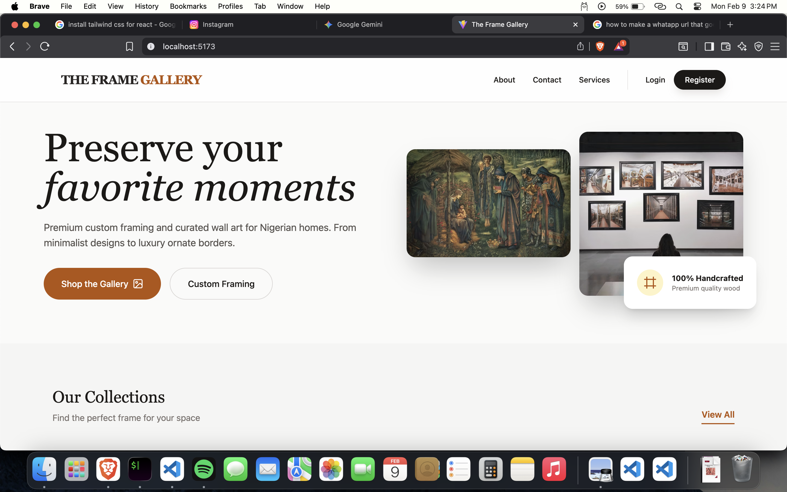
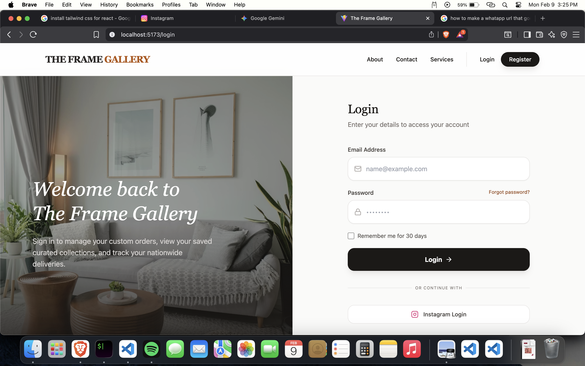

# The Frame Gallery Project 




The Frame Gallery is a premium web platform designed for Nigerian homes, offering museum-grade custom framing and curated wall art. From minimalist wooden designs to luxury ornate gold borders, we combine traditional joinery techniques with modern aesthetics to preserve your favorite moments for a lifetime.

## 🚀 Features

* **Custom Framing Gallery:** Browse curated collections including Minimalist Wood, Ornate Gold, and Gallery Sets.
* **Artisan Craftsmanship:** Detailed service pages showcasing our 3-step sanding process and archival-quality materials.
* **Nationwide Delivery:** Integrated information on our multi-layer impact protection packaging for safe delivery across Nigeria.
* **Responsive Experience:** Fully optimized for mobile, tablet, and desktop viewing with smooth transitions.
* **User Accounts:** Secure login and registration system for tracking orders and saving favorites.
* **Interactive UI:** Sliding alerts for form feedback and animated mobile navigation using Framer Motion.


## 🛠️ Tech Stack

* **Frontend:** [React.js](https://reactjs.org/) (Functional Components & Hooks)
* **Styling:** [Tailwind CSS](https://tailwindcss.com/) (Utility-first CSS)
* **Icons:** [Lucide-React](https://lucide.dev/)
* **Animations:** [Framer Motion](https://www.framer.com/motion/)
* **Authentication Logic:** [JWT-Decode](https://www.npmjs.com/package/jwt-decode) & [JS-Cookie](https://www.npmjs.com/package/js-cookie)


## 📂 Project Structure

```bash
src/
 ├── Components/
 │    ├── Navbar/          # Responsive navigation with Auth logic
 │    ├── Footer/          # Brand info and social links
 │    └── AlertBox/        # Sliding notification component
 ├── Pages/
 │    ├── Home.jsx         # Hero section and collections
 │    ├── About.jsx        # Brand story and mission
 │    ├── Services.jsx     # Craftsmanship and delivery details
 │    ├── Login.jsx        # User authentication
 │    ├── Register.jsx     # Account creation
 │    └── Error404.jsx     # Custom "Empty Frame" error page
 └── App.jsx               # Routing and global state

```


## 📦 Installation & Setup

1. **Clone the repository:**
```bash
git clone https://github.com/yourusername/the-frame-gallery.git

```


2. **Install dependencies:**
```bash
npm install

```


3. **Run the development server:**
```bash
npm run dev

```


## 📞 Contact & Support

* **Founder:** Amy
* **Phone/WhatsApp:** +234 (0) 906 889 8645
* **Instagram:** [@theframegallery.ng](https://instagram.com/theframegallery.ng)
* **Location:** Lagos, Nigeria (Shipping Nationwide 🚚)

---

> *"We believe that a well-framed piece of art can change the entire energy of a home."*

Would you like me to add a **"Contribution"** section or a **"License"** block to this file?